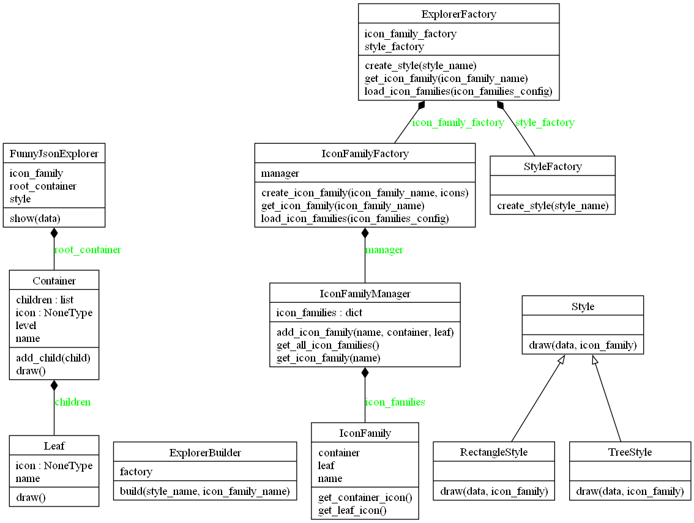
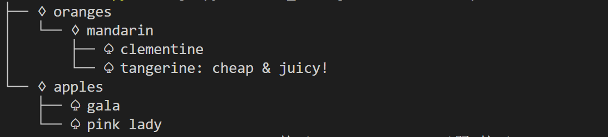
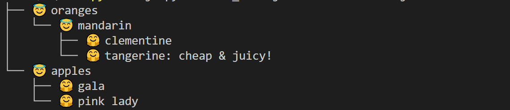
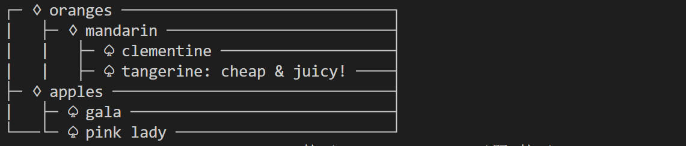
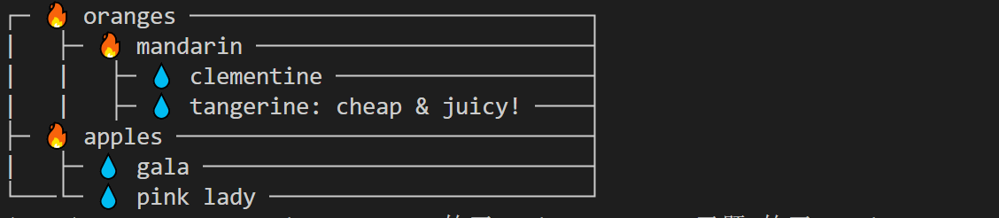

# Funny JSON Explorer

Funny JSON Explorer（**FJE**）

​									—— 一个JSON文件可视化的命令行界面小工具

## 使用方法

在项目根目录使用以下命令：

```shell
cd FJE
python fje.py -f <json file> -s <style> -i <icon family>
```

其中`<json file>`为待可视化的JSON文文件，`<style>`为可视化风格，`<icon family>`为指定的图标族

即可将JSON文件进行可视化：

```json
{
    oranges: {
        'mandarin': {                            ├─ oranges
            clementine: null,                    │  └─ mandarin
            tangerine: 'cheap & juicy!'  -=>     │     ├─ clementine
        }                                        │     └─ tangerine: cheap & juicy!
    },                                           └─ apples
    apples: {                                       ├─ gala
        'gala': null,                               └─ pink lady
        'pink lady': null
    }
}
```


## 功能介绍

### 指定不同风格

FJE可以快速切换**风格**（style），包括：树形（tree）、矩形（rectangle）

```python
# 树形风格
python fje.py -f test_file.json -s tree -i pocker  
├── ♢ oranges
│   └── ♢ mandarin
│       ├── ♤ clementine
│       └── ♤ tangerine: cheap & juicy!
└── ♢ apples
    ├── ♤ gala
    └── ♤ pink lady
    
# 矩形风格
python fje.py -f test_file.json -s rectangle -i pocker
┌─ ♢ oranges ──────────────────────────────┐
|   ├─ ♢ mandarin ─────────────────────────┤
|   |   ├─ ♤ clementine ───────────────────┤
|   |   ├─ ♤ tangerine: cheap & juicy! ────┤
├─ ♢ apples ───────────────────────────────┤
|   ├─ ♤ gala ─────────────────────────────┤
└───└─ ♤ pink lady ────────────────────────┘
```

### 指定不同图标族

也可以指定**图标族**（icon family），为中间节点或叶节点指定一套icon

```python
# 中间节点icon：🔥  叶节点icon：💧   
python fje.py -f test_file.json -s tree -i fire_water
├── 🔥 oranges
│   └── 🔥 mandarin
│       ├── 💧 clementine
│       └── 💧 tangerine: cheap & juicy!
└── 🔥 apples
    ├── 💧 gala
    └── 💧 pink lady

# 中间节点icon：😇 叶节点icon：🤗   
python fje.py -f test_file.json -s tree -i emoji
├── 😇 oranges
│   └── 😇 mandarin
│       ├── 🤗 clementine
│       └── 🤗 tangerine: cheap & juicy!
└── 😇 apples
    ├── 🤗 gala
    └── 🤗 pink lady
```

### 添加新的风格

继承抽象基类`Style`，实现新的风格，并将新风格添加到`config.json`即可！

```json
"styles": {
    "tree": "tree_style.py",
    "rectangle": "rectangle_style.py"
    // 风格名 : 实现文件
}
```

### 添加新的图标族

只需修改`config.json`，定义新图标族名称，中间结点和叶节点对应的图标即可！

```json
"icon_families": {
    "pocker": {
      "icon_container": "♢",
      "icon_leaf": "♤"
    },
    //图表族名 : {
	//	"icon_container": 中间结点图标，
	//	"icon_leaf": 叶节点图标
	//}
}
```


## 设计文档

### 类图



### 设计模式及作用

1. **工厂模式（Factory Pattern）**：
   - `IconFamilyFactory` 和 `StyleFactory` 是工厂类，它们分别负责创建 `IconFamily` 和 `Style` 对象。
   - `ExplorerFactory` 通过组合 `IconFamilyFactory` 和 `StyleFactory` 来创建 `IconFamily` 和 `Style` 对象。
   - 这些工厂方法隐藏了具体实现细节，使代码更具可扩展性和可维护性。
2. **组合模式（Composite Pattern）**：
   - `Container` 和 `Leaf` 类实现了组合模式。`Container` 类可以包含多个子节点（`children`），这些子节点可以是 `Leaf` 对象或其他 `Container` 对象。
   - `FunnyJsonExplorer` 类中有一个 `root_container` 属性，它是组合模式的根节点。
3. **建造者模式（Builder Pattern）**：
   - `ExplorerBuilder` 类使用建造者模式来创建 `FunnyJsonExplorer` 对象。它通过 `build` 方法，根据提供的 `style_name` 和 `icon_family_name` 创建并返回一个 `FunnyJsonExplorer` 实例。
   - `build` 方法将创建 `Style` 和 `IconFamily` 的步骤分开，使得对象的创建过程更加清晰和灵活。


## 运行截图

- 树形结构

  - pocker图标族（container: `♢`, leaf: `♤`）

    

  - emoji图标族（container: `😇`, leaf: `🤗`）

    

- 长方形结构

  - pocker图标族（container: `♢`, leaf: `♤`）

    

  - fire_water图标族（container: `🔥`, leaf: `💧`）

    